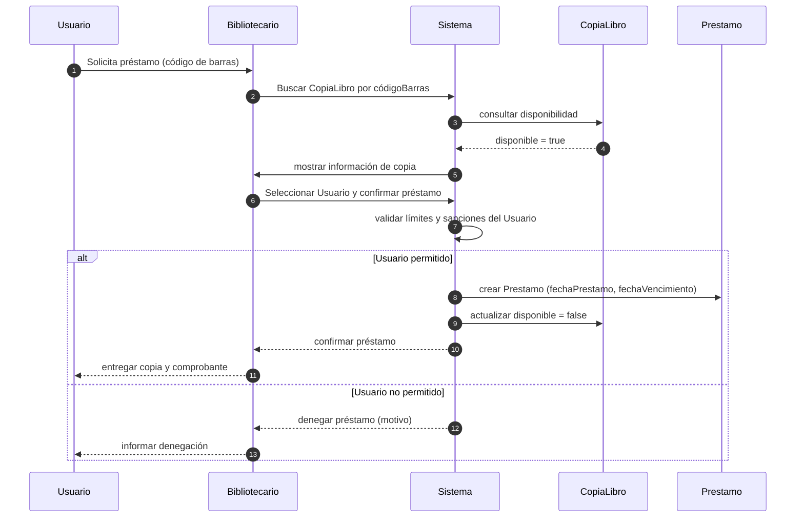
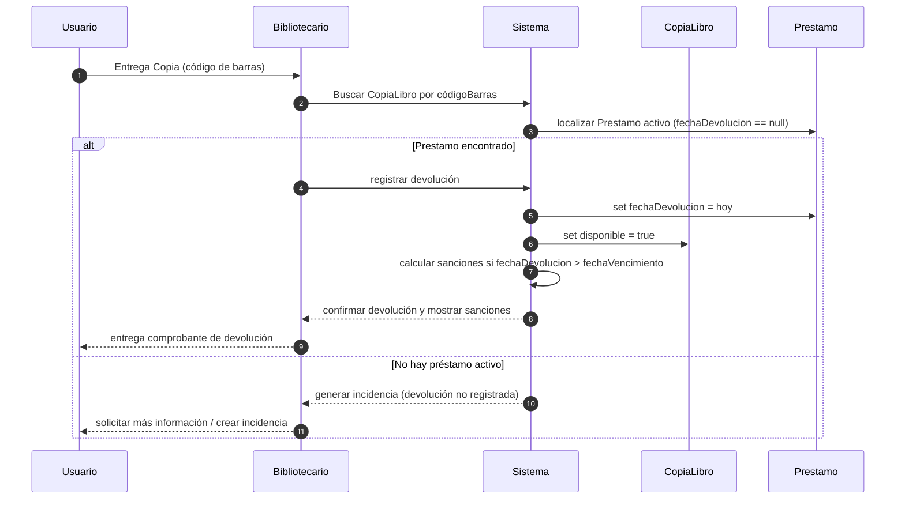

# Diagramas de secuencia

Este documento contiene diagramas de secuencia (Mermaid) para los casos de uso "Préstamo" y "Devolución" basados en el modelo de clases del sistema de biblioteca.

---

## Préstamo de copia de libro

---

## Devolución de copia de libro

---

Notas:
- Los diagramas usan participantes simplificados (`Sistema` agrupa la lógica de negocio y persistencia).
- Si quieres, puedo separar `Sistema` en `ServicioPrestamo`, `RepositorioCopia`, y `ServicioNotificaciones` para mayor granularidad.
