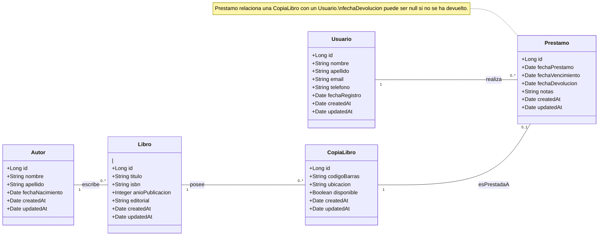

# Modelo de clases

```mermaid
%% Diagrama de clases para biblioteca
classDiagram
    direction LR

    class Autor {
        +Long id
        +String nombre
        +String apellido
        +Date fechaNacimiento
        +Date createdAt
        +Date updatedAt
    }

    class Libro {|
        +Long id
        +String titulo
        +String isbn
        +Integer anioPublicacion
        +String editorial
        +Date createdAt
        +Date updatedAt
    }

    class CopiaLibro {
        +Long id
        +String codigoBarras
        +String ubicacion
        +Boolean disponible
        +Date createdAt
        +Date updatedAt
    }

    class Usuario {
        +Long id
        +String nombre
        +String apellido
        +String email
        +String telefono
        +Date fechaRegistro
        +Date createdAt
        +Date updatedAt
    }

    class Prestamo {
        +Long id
        +Date fechaPrestamo
        +Date fechaVencimiento
        +Date fechaDevolucion
        +String notas
        +Date createdAt
        +Date updatedAt
    }

    %% Relaciones
    Autor "1" -- "0..*" Libro : escribe
    Libro "1" -- "0..*" CopiaLibro : posee
    Usuario "1" -- "0..*" Prestamo : realiza
    CopiaLibro "1" -- "0..1" Prestamo : esPrestadaA

    %% Notas de integridad
    note for Prestamo "Prestamo relaciona una CopiaLibro con un Usuario.\nfechaDevolucion puede ser null si no se ha devuelto."
```